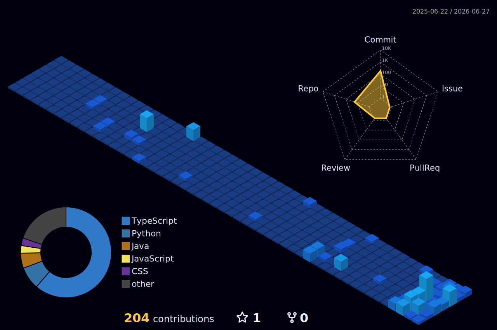

<div align="center">
  

  <a href="https://git.io/typing-svg">
    
  </a>
</div>

<br/>

## 👨‍💻 My Journey

<div align="center">
  <blockquote>
    <strong>"Evolving from single-celled yellow organisms at the dawn of time, Minions have always sought to serve the biggest, baddest bosses. I just want to write the biggest, baddest code."</strong>
  </blockquote>
  <p>Just like Kevin, Stuart, and Bob venturing out to 1960s New York City to find a new master, my journey revolves around venturing into the depths of <strong>Cyber Security & Digital Forensics</strong>. I am a highly motivated Computer Science student at <strong>VIT Bhopal University</strong> (CGPA: 8.5) with a <em>"giant heart"</em> (just like Bob!) for securing digital ecosystems and building unbreakable systems.</p>
</div>

```python
class ShreeCharan:
    def __init__(self):
        self.name = "Shree Charan N"
        self.role = "Cybersecurity Intern @ HAL & MP Police"
        self.location = "Bengaluru, Karnataka, India"
        self.hobbies = ["Cryptography", "Steganography", "Android Dev", "Machine Learning"]

    def current_focus(self):
        return "Architecting DRM-based encryption systems & AI/ML attack analysis models."
        
    def goals(self):
        return "To build unbreakable systems and innovate in the digital forensics space."
```

---

## 🛠️ Technology Arsenal

<div align="center">
  <table>
    <tr>
      <td align="center" width="25%">
        <h3>💻 Languages</h3>
        <br>
        
        
        
        <br><br>
        
        
      </td>
      <td align="center" width="25%">
        <h3>🛡️ Cybersecurity</h3>
        <br>
        
        <br><br>
        
        <br><br>
        
      </td>
      <td align="center" width="25%">
        <h3>⚙️ Tools & Platforms</h3>
        <br>
        
        
        
        <br><br>
        
        
      </td>
      <td align="center" width="25%">
        <h3>🧠 AI / ML</h3>
        <br>
        
        
        <br><br>
        
      </td>
    </tr>
  </table>
</div>

---

## 🍌 Minion-Approved Hacker Stats

<table align="center" style="border:none;">
  <tr>
    <td width="30%" align="center">
      
      <br>
      <em>"Sweet and naïve, a tiny minion with a giant heart."</em>
      <br><br>
      
    </td>
    <td width="70%" align="center">
      
    </td>
  </tr>
</table>

---

## 🌃 Cyber-City Commit Graph
*(This is my commit history rendered as a glowing 3D cyberpunk city!)*

<div align="center">
  <picture>
    <source media="(prefers-color-scheme: dark)" srcset="./profile-3d-contrib/profile-night-view.svg">
    <source media="(prefers-color-scheme: light)" srcset="./profile-3d-contrib/profile-gitblock.svg">
    
  </picture>
</div>

<br>

<div align="center">
  
  
</div>

---

## 🤝 Let's Connect!

<div align="center">
  <a href="mailto:shreecharan5277443@gmail.com"></a>
  <a href="https://linkedin.com/in/shree-charan-n"></a>
  <a href="https://github.com/Charan291005"></a>
</div>

<br>
<p align="center">
  
</p>
